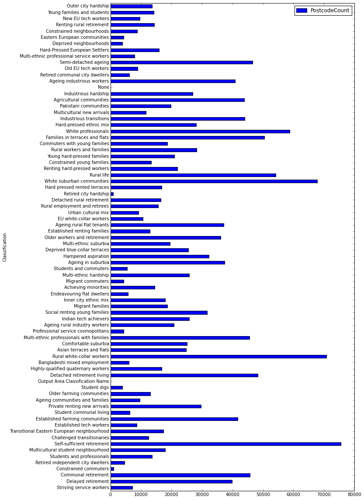

    %pylab inline
    from pyspark.sql.types import *
    
    hc = HiveContext(sc)

    Populating the interactive namespace from numpy and matplotlib
    

    acs = hc.sql("SELECT OutputAreaClassificationName AS Classification, COUNT(1) AS PostcodeCount FROM Postcodes GROUP BY OutputAreaClassificationName")
    acs.cache()

    DataFrame[Classification: string, PostcodeCount: bigint]

    p_acs = acs.toPandas()
    p_acs.sort('PostcodeCount', ascending=0)[:15]

<table border="1" class="dataframe">
  <thead>
    <tr style="text-align: right;">
      <th></th>
      <th>Classification</th>
      <th>PostcodeCount</th>
    </tr>
  </thead>
  <tbody>
    <tr>
      <th>7</th>
      <td>Self-sufficient retirement</td>
      <td>75577</td>
    </tr>
    <tr>
      <th>21</th>
      <td>Rural white-collar workers</td>
      <td>70876</td>
    </tr>
    <tr>
      <th>49</th>
      <td>White suburban communities</td>
      <td>67820</td>
    </tr>
    <tr>
      <th>57</th>
      <td>White professionals</td>
      <td>58824</td>
    </tr>
    <tr>
      <th>50</th>
      <td>Rural life</td>
      <td>54232</td>
    </tr>
    <tr>
      <th>56</th>
      <td>Families in terraces and flats</td>
      <td>50524</td>
    </tr>
    <tr>
      <th>18</th>
      <td>Detached retirement living</td>
      <td>48311</td>
    </tr>
    <tr>
      <th>68</th>
      <td>Semi-detached ageing</td>
      <td>46526</td>
    </tr>
    <tr>
      <th>2</th>
      <td>Communal retirement</td>
      <td>45784</td>
    </tr>
    <tr>
      <th>24</th>
      <td>Multi-ethnic professionals with families</td>
      <td>45653</td>
    </tr>
    <tr>
      <th>59</th>
      <td>Industrious transitions</td>
      <td>44007</td>
    </tr>
    <tr>
      <th>62</th>
      <td>Agricultural communities</td>
      <td>43885</td>
    </tr>
    <tr>
      <th>11</th>
      <td>Established farming communities</td>
      <td>41669</td>
    </tr>
    <tr>
      <th>65</th>
      <td>Ageing industrious workers</td>
      <td>40913</td>
    </tr>
    <tr>
      <th>1</th>
      <td>Delayed retirement</td>
      <td>39813</td>
    </tr>
  </tbody>
</table>

    p_acs.plot(x='Classification', y='PostcodeCount', kind='barh', figsize=[10,20])

    <matplotlib.axes._subplots.AxesSubplot at 0xa91a390>

    all_postcodes = hc.sql("SELECT Postcode3 AS Postcode, OutputAreaClassificationName AS Classification FROM Postcodes WHERE Postcode3 IS NOT NULL")
    all_postcodes.cache()

    DataFrame[Postcode: string, Classification: string]

    all_postcodes.first()

    Row(Postcode=u'Postcode 3', Classification=u'Output Area Classification Name')

    all_postcodes.where(all_postcodes.Postcode == "PL21 9TY").first().Classification

    u'White suburban communities'

    
