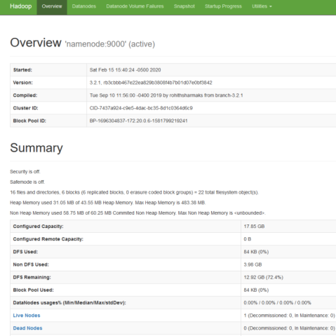

# Hadoop POC

## Prerequisites

Docker     
Docker Compose 

## Run

```
cd Hadoop
docker-compose -f docker-compose.yml pull
docker-compose -f docker-compose.yml up
```

## Shutdown

```
cd Hadoop
docker-compose -f docker-compose.yml down

docker system prune
```

### Dashboard

```
http://<dockerhadoop_IP_address>:9870/dfshealth.html#tab-overview
```


