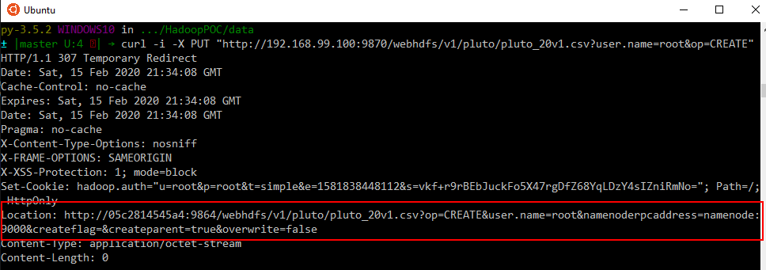

## DataSet 

### PLUTO and MapPLUTO

Download and Extract to ```/data``` Directory

```
https://www1.nyc.gov/site/planning/data-maps/open-data/dwn-pluto-mappluto.page
```


### Load Data 


Make Directory

```
curl -i -X PUT "http://192.168.99.100:9870/webhdfs/v1/pluto?user.name=root&op=MKDIRS"
```

## Create File
```
curl -i -X PUT "http://192.168.99.100:9870/webhdfs/v1/pluto/pluto_20v1.csv?user.name=root&op=CREATE"
```




